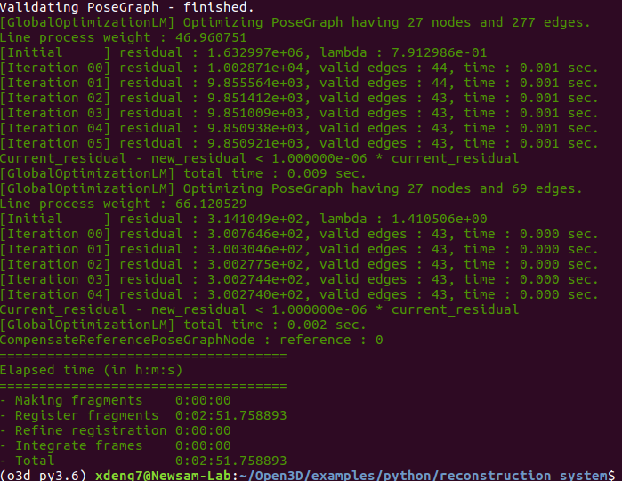
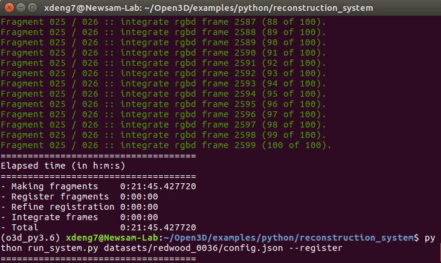

# Redwood Open3D 3D Reconstruction
An example project using Open3d for 3d reconstruction with RGB-D images
This is implemented by using the open-sourced tools [Open3D](http://www.open3d.org/). Souce code is available at (https://github.com/intel-isl/Open3D)


**System requirements:**

* Ubuntu 16.04 (not support 16.04+)
* Anaconda 4.7.11
* Python 3.6
* OpenCV
* Open3D 0.9.0 (not support 0.9.0+)

## Set up environment

```bash
# Clone the project to local machine
$ git clone https://github.com/xdeng7/redwood_open3d_3dreconstruction.git

# Set up dependency, need to install Anaconda first
$ sh requirements/install.sh

```
## Download data
Any RGB-D dataset should work. In this repo, the open-sourced dataset Redwood is used.
Data can be download at (http://redwood-data.org/3dscan/dataset.html).
Unzip the .zip file, and put the data under the folder 'ROOT_DIR/Open3D/examples/python/reconstruction_system/datasets/YOUR_DATA_FOLDER'

For exmaple, my data dir is '/home/xdeng7/Open3D/examples/python/reconstruction_system/datasets/redwood_0036'

Under the data folder, the depth and rgb data should placed into two different folders. 
Please download config.json available at [Google Drive]()
Please follow the directory structure as follows:

```                                                                                         
├── datasets                                                                                                                                                                                                   
│   ├── redwood_0036                                                                                                 
│   │   └── depth   # depth data                                                                                                                           
│   │   └── rgb     # rgb data        
|   |   └── config.json  # experimental hyperparameters
|   |   └── ...
|   ├── ...

```

## Quick start
Four steps to build 3D reconstruction with your RGB-D data. 
* make
* register
* refine
* integrate

```bash
# The tools is in examples
cd Open3D/examples/python/reconstruction_system
# 1) create fragements
python run_system.py datasets/config.json --make
```
**Generated images from the converted pretrained FFHQ weight**


**Generated images from the converted pretrained FFHQ weight**

```bash
# 2) register fragements
python run_system.py datasets/config.json --register
```
**Generated images from the converted pretrained FFHQ weight**



**Generated images from the converted pretrained FFHQ weight**

```bash
# 3) refine fragements
python run_system.py datasets/config.json --refine
```


**Generated images from the converted pretrained FFHQ weight**

```bash
# 3) integrate and create the 3d mesh scene 
python run_system.py datasets/config.json --integrate
```


